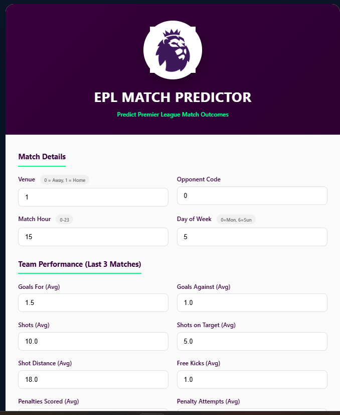

ChatGPT said:

Perfect 🔥 — here’s a GitHub-ready README.md for your EPL Prediction Flask App project.
It follows professional open-source formatting — complete with badges, setup steps, structure, and demo link.

# ⚽ EPL Match Outcome Prediction (Flask + Hugging Face Spaces)

> 🧠 A machine learning–based Flask web app that predicts English Premier League (EPL) match outcomes (Win / Loss / Draw) using pre-match statistics and rolling averages.

🔗 **Live Demo:** [https://huggingface.co/spaces/yashraj195/epl](https://huggingface.co/spaces/yashraj195/epl)

---

## 🚀 Features

- Predicts EPL match outcomes using a trained **Random Forest Classifier**
- Simple REST API endpoint (`/predict`)
- Clean Flask-based web backend
- Deployed seamlessly on **Hugging Face Spaces**
- Fully open-source and reproducible

---

## 🧩 Tech Stack

| Layer | Technology |
|-------|-------------|
| **Frontend** | HTML, CSS (via Flask templates) |
| **Backend** | Flask (Python) |
| **ML Model** | Scikit-learn RandomForestClassifier |
| **Deployment** | Hugging Face Spaces |
| **Libraries** | pandas, numpy, scikit-learn, flask |

Output → `Win`, `Loss`, or `Draw`.

---

## 🗂️ Project Structure

epl-prediction/
│
├── app.py # Main Flask app
├── model.pkl # Serialized trained model
├── requirements.txt # Dependencies
│
├── templates/
│ ├── index.html # Input form
│ └── result.html # Prediction output
│
├── data/
│ └── matches.csv # Dataset used for training
│
├── notebooks/
│ └── model_training.ipynb # EDA and training notebook
│
└── README.md

## 🧑‍💻 Author
Yash Raj
💼 Technology Enthusiast | Web & ML Developer

## 📜 License

This project is released under the MIT License.
Feel free to use, modify, and share.

### 🌟 If you like this project, give it a ⭐ on GitHub — it helps a lot!
